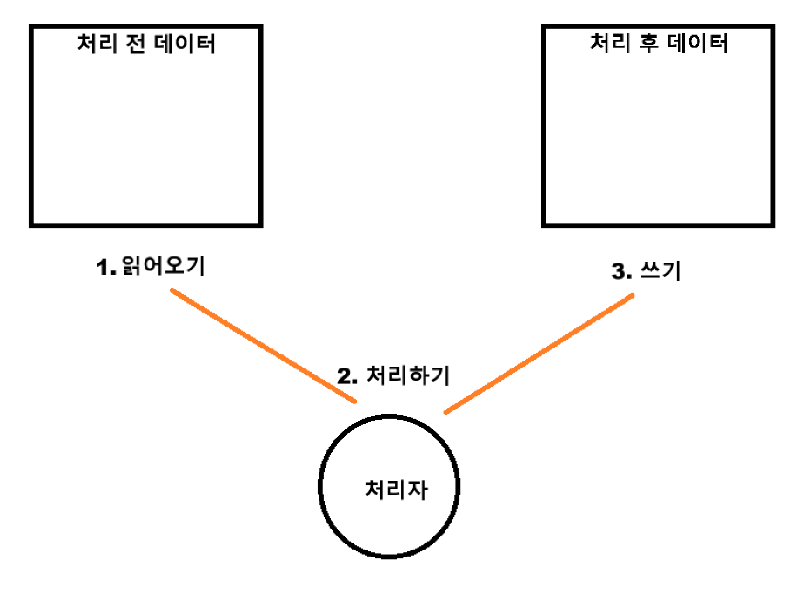

## 배치 애플리케이션

### 배치 어플리케이션이란?
> 개발자가 정의한 작업을 한번에 일괄 처리하는 어플리케이션
- 매출 데이터를 이용한 일매출 집계
- 매우 큰 데이터를 활용한 보험급여 결정

위와 같은 것들이 배치를 적용한 어플리케이션

### 왜 사용하는가?
아주 많은 데이터를 처리 하는 중간에 프로그램이 멈춘다면 어디서부터 했는지 알 수 없게된다.  
이런 상황을 대비해 특정 작업을 처리하고 어느 지점까지 작업을 진행했는지 등 작업을 관리하기 위해 사용

### 배치에서 중요한 부분

- 위 부분에서 내가 어디까지 처리했는지 계속 파악하는 것이 중요
- 이미 했던 일을 중복해서 하지 않기 위해

위와 같이 중복이나 놓치는 부분을 파악하기 위해서는 **기록**하는 부분이 아주 중요  
  
### 왜 데이터를 한번에 다 읽지 않는가?
밀린 빨래를 한다고 생각해보자

일주일 동안 쌓인 빨래가 많아 세탁기 용량을 초과해버렸다.  

결국 세탁기가 제대로 동작하지 않아 고장이 나거나 돌더라도 깨끗하게 빨리지 않을 수 있다.  

이처럼 데이터도 한번에 많은 양을 읽어온다면 메모리 과부하나 속도적인 측면에서 문제가 발생할 수 있어 데이터를 끊어서 읽게 한다.  

### 메타 데이터
위에서 결국 작업은 데이터를 끊어서 읽어와서 실행하는데 
이때 어디까지 했는지, 어디를 했었는지를 파악하기 위해 기록하는 테이블이 필요하며 이를 "메타 데이터"라고 한다

### 배치 내부 구조도

- JobLauncher
  - 하나의 배치 작업을 실행 시키는 시작점
- Job
  - 읽기 - 처리 - 쓰기 과정을 정의한 배치 작업
- Step
  - 실제 하나의 읽기 - 처리 - 쓰기 작업을 정의한 부분으로 1개의 Job에서 여러 Step을 진행할 수 있다.
